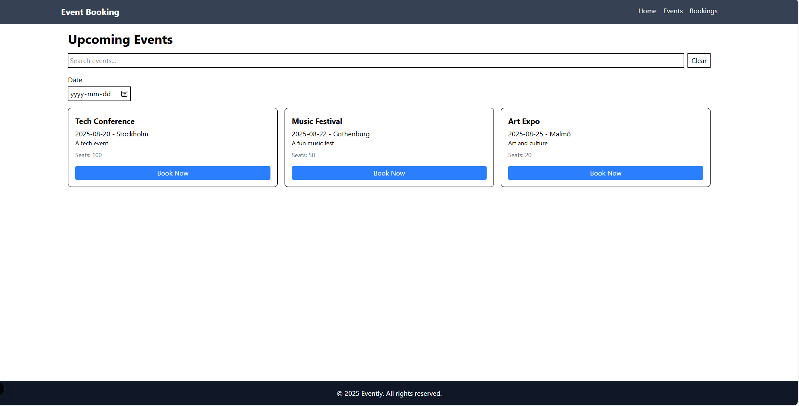
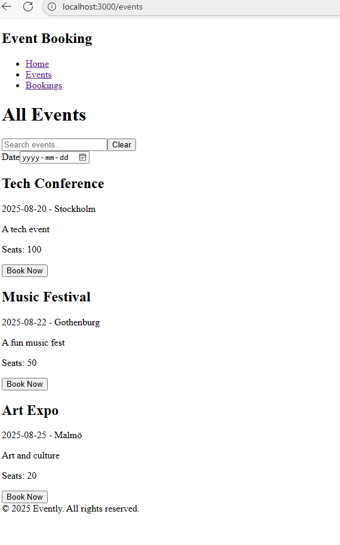
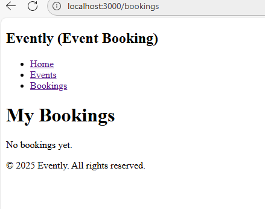
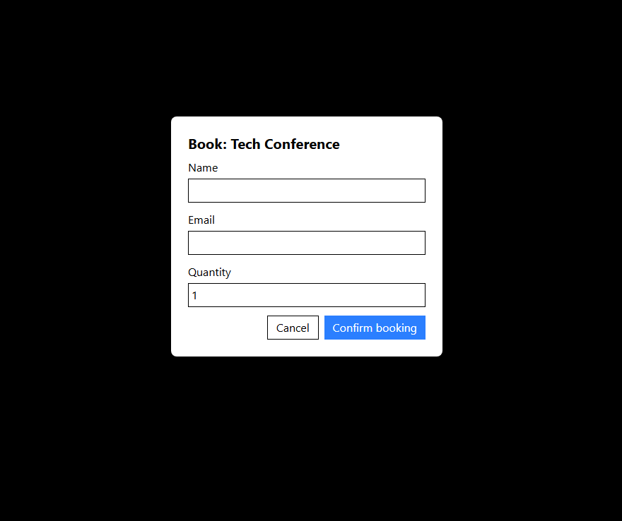

Event Booking

A responsive and user-friendly event booking web application that allows users to view and book upcoming events. This project is built using next with TypeScript and demonstrates simple design, accessibility, and basic form interactions.

Overview.

.This app allows users to:

.Browse a list of upcoming events.

.Search and filter events by name or date.

.Book available events.

.View real-time seat availability.

Features & Functionality
🔸Main Page / Events Screen

Heading: "Upcoming Events"

Search bar: Filter events by typing part of the name.

Date Picker: Filter events happening on a specific date.

Clear Button: Resets the filters.

🔸 Event Cards

Each event card displays:

Title

Date & Location (e.g., 2025-08-20 - Stockholm)

Description

Seats Available

A "Book Now" button

FEATURE:-

This is Main Page in this page header, footer and main page shows. On that page when we click events it shows how many events is coming in which date.

when you click booking then the link will be opened and shows on that way

For booking you can click on main page what event you want to book may its related to Tech, Music or Art. so while clicking you can get  booking form by filling you can book your tickets.

TESTING 
1) Header - Title shows, 3 links exist, href correct. 
getByText, getByRole('link'), getAllByRole('link')

2) Footer -  Footer text shows current year; correct role (contentinfo); no extra links
getByRole('contentinfo'), getByText, queryByRole('link')

3) EventCard - Renders event details (name, date, location, description, seats); Book Now button exists and fires callback.
getByText, getByRole('heading'), getByRole('button'), fireEvent.click

4) EventList - Renders multiple events; clicking Book opens modal; Close/Confirm hides modal.
getByText, getAllByText, getByRole('button'), queryByText, fireEvent.click

5) DateFilter
Renders date input with label; input type is date; changing value calls onChange; safe when missing prop
getByLabelText, fireEvent.change

6) SearchBar
Renders input (searchbox) + Clear button; typing triggers onSearch; Clear resets value
getByRole('searchbox'), getByRole('button'), fireEvent.change, fireEvent.click

7) BookingModal
Has dialog role; shows event name; BookingForm rendered; Cancel calls onClose; Confirm calls onConfirm
getByRole('dialog'), getByText, fireEvent.click, getByTestId.

8) BookingForm
Inputs (name, email, quantity) render; updates values; shows errors (empty fields, too many seats); Cancel & Confirm work
getByLabelText, getByText, fireEvent.change, fireEvent.click

this testing includes unit test and integration test.